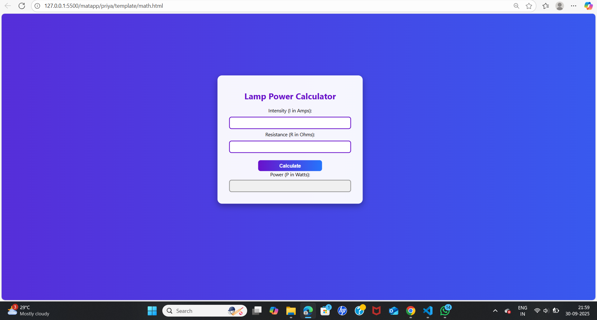

# Ex.05 Design a Website for Server Side Processing
# Date:30.09.2025
# AIM:
To design a website to calculate the power of a lamp filament in an incandescent bulb in the server side.

# FORMULA:
P = I2R
P --> Power (in watts)
 I --> Intensity
 R --> Resistance

# DESIGN STEPS:
## Step 1:
Clone the repository from GitHub.

## Step 2:
Create Django Admin project.

## Step 3:
Create a New App under the Django Admin project.

## Step 4:
Create python programs for views and urls to perform server side processing.

## Step 5:
Create a HTML file to implement form based input and output.

## Step 6:
Publish the website in the given URL.

# PROGRAM :

math.html
```
<!DOCTYPE html>
<html lang="en">
<head>
    <meta charset="UTF-8">
    <title>Lamp Power Calculator</title>
    <style>
        body {
            margin: 0;
            padding: 0;
            font-family: 'Segoe UI', Tahoma, Geneva, Verdana, sans-serif;
            background: linear-gradient(to right, #6a11cb, #2575fc);
            height: 100vh;
            display: flex;
            justify-content: center;
            align-items: center;
        }

        .box {
            width: 420px;
            padding: 30px;
            background-color: rgba(255, 255, 255, 0.95);
            border-radius: 15px;
            box-shadow: 0 8px 20px rgba(0,0,0,0.3);
            text-align: center;
        }

        h1 {
            color: #6a11cb;
            font-size: 28px;
            margin-bottom: 20px;
        }

        input[type="text"] {
            width: 90%;
            padding: 10px;
            margin: 8px 0;
            border: 2px solid #6a11cb;
            border-radius: 8px;
            outline: none;
            font-size: 16px;
        }

        input[type="submit"] {
            width: 50%;
            padding: 10px;
            margin-top: 15px;
            background: linear-gradient(to right, #6a11cb, #2575fc);
            color: white;
            font-size: 16px;
            font-weight: bold;
            border: none;
            border-radius: 8px;
            cursor: pointer;
        }

        input[type="submit"]:hover {
            background: linear-gradient(to right, #2575fc, #6a11cb);
        }

        .result input[type="text"] {
            background-color: #f0f0f0;
            border-color: #999;
            font-weight: bold;
        }
    </style>
</head>
<body>
    <div class="box">
        <h1>Lamp Power Calculator</h1>
        <form method="POST">
            Intensity (I in Amps): <input type="text" name="intensity" value=""><br>
            Resistance (R in Ohms): <input type="text" name="resistance" value=""><br>
            <input type="submit" value="Calculate"><br>
            <div class="result">
                Power (P in Watts): <input type="text" name="power" value="" readonly><br>
            </div>
        </form>
    </div>
</body>
</html>
```
urls.py
```
from django.contrib import admin
from django.urls import path
from priya import views

urlpatterns = [
    path('admin/', admin.site.urls),
    path('', views.lamp_power, name='lamp_power'),
]
```
views.py
```
from django.shortcuts import render

def lamp_power(request):
    I = R = P = ''
    
    if request.method == 'POST':
        try:
            I = float(request.POST.get('intensity', 0))
            R = float(request.POST.get('resistance', 0))
            P = I ** 2 * R
        except ValueError:
            P = "Invalid input"

    context = {
        'I': I,
        'R': R,
        'P': P
    }

    return render(request, 'priya/math.html', context)
 ```
 # SERVER SIDE PROCESSING:
.png>)

# HOMEPAGE:


# RESULT:
The program for performing server side processing is completed successfully.
